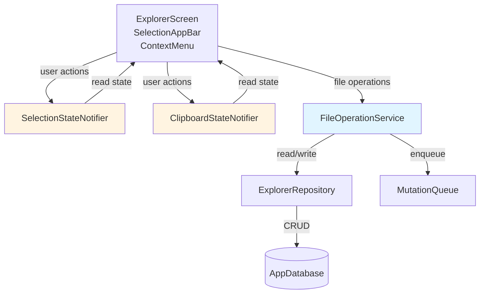

# Design Document: Advanced File Manager

## Overview

The Advanced File Manager enhances the existing JARVIS mobile app file explorer with multi-select, drag-and-drop, batch operations, and clipboard functionality. The design integrates with the existing Clean Architecture structure, leveraging the current ExplorerRepository, AppDatabase (SQLite/Drift), and Riverpod state management.

### Design Goals

1. **Performance**: Handle 1000+ files without UI degradation (60 FPS scrolling, <16ms selection updates)
2. **Data Integrity**: Ensure all operations maintain database consistency and sync reliably
3. **User Experience**: Provide intuitive multi-select, drag-and-drop, and clipboard operations
4. **Integration**: Seamlessly extend existing explorer without breaking current functionality
5. **Maintainability**: Follow Clean Architecture with clear separation of concerns

### Key Architectural Decisions

1. **Enhance Existing Module**: Extend `mobile/lib/features/explorer/` rather than creating a separate module to avoid duplication and maintain consistency
2. **Service Layer**: Introduce `FileOperationService` for complex operations (move, copy, delete, rename) while keeping simple queries in ExplorerRepository
3. **State Separation**: Use dedicated Riverpod providers for selection and clipboard state to prevent unnecessary rebuilds of the file list
4. **Optimistic Updates**: Update local database immediately and queue mutations for background sync
5. **Batch Processing**: Process batch operations sequentially with individual error handling to maximize success rate

## Architecture

### System Components



### Layer Responsibilities

**Presentation Layer** (`presentation/`)
- `ExplorerScreen`: Main file list with selection mode support
- `SelectionAppBar`: Action bar displayed when items are selected
- `ContextMenu`: Long-press/right-click menu for file operations
- `DraggableFileTile`: Wrapper enabling drag functionality
- `DragTargetFolder`: Wrapper enabling drop zones on folders

**Domain Layer** (`domain/`)
- `FileOperationService`: Orchestrates complex file operations
- `SelectionStateNotifier`: Manages multi-select state
- `ClipboardStateNotifier`: Manages cut/copy/paste state

**Data Layer** (`data/`)
- `ExplorerRepository`: Existing repository for file CRUD operations
- `AppDatabase`: Existing SQLite database with file_entries table
- `MutationQueue`: Existing sync queue for server operations

### Data Flow

#### Move Operation Flow
```
User Action → FileOperationService.moveFiles()
  ↓
Validate paths (prevent circular moves)
  ↓
For each file:
  - Update path in AppDatabase
  - Enqueue move mutation
  ↓
Return FileOperationResult
  ↓
UI displays success/error feedback
```

#### Selection State Flow
```
User taps file → SelectionStateNotifier.toggle(fileId)
  ↓
Update Set<String> of selected IDs
  ↓
Notify listeners (only selection-dependent widgets rebuild)
  ↓
UI updates checkboxes/highlights
```

## Components and Interfaces

### FileOperationService

Primary service for file operations with validation and error handling.

```dart
class FileOperationService {
  final ExplorerRepository _repository;
  final MutationQueue _mutationQueue;
  
  /// Move a single file to target folder
  Future<FileOperationResult> moveFile(
    String fileId,
    String targetFolderId,
  );
  
  /// Move multiple files to target folder
  Future<FileOperationResult> moveFiles(
    List<String> fileIds,
    String targetFolderId,
  );
  
  /// Copy a single file to target folder
  Future<FileOperationResult> copyFile(
    String fileId,
    String targetFolderId,
  );
  
  /// Copy multiple files to target folder
  Future<FileOperationResult> copyFiles(
    List<String> fileIds,
    String targetFolderId,
  );
  
  /// Delete a single file (recursive for folders)
  Future<FileOperationResult> deleteFile(String fileId);
  
  /// Delete multiple files (recursive for folders)
  Future<FileOperationResult> deleteFiles(List<String> fileIds);
  
  /// Rename a file
  Future<FileOperationResult> renameFile(
    String fileId,
    String newName,
  );
  
  // Private helper methods
  Future<bool> _validateMove(String fileId, String targetFolderId);
  Future<bool> _isCircularMove(String fileId, String targetFolderId);
  Future<String> _generateUniqueName(String baseName, String parentPath);
  Future<List<String>> _getDescendantIds(String folderId);
}
```

### SelectionStateNotifier

Manages multi-select state with efficient Set-based storage.

```dart
class SelectionState {
  final Set<String> selectedIds;
  final bool isSelectionMode;
  
  const SelectionState({
    this.selectedIds = const {},
    this.isSelectionMode = false,
  });
}

class SelectionStateNotifier extends StateNotifier<SelectionState> {
  SelectionStateNotifier() : super(const SelectionState());
  
  /// Toggle selection for a single file
  void toggle(String fileId);
  
  /// Select all files in current view
  void selectAll(List<String> allFileIds);
  
  /// Clear all selections
  void clear();
  
  /// Select range between two indices
  void selectRange(List<String> orderedFileIds, int start, int end);
  
  /// Check if a file is selected
  bool isSelected(String fileId);
  
  /// Get count of selected items
  int get selectedCount;
}
```

### ClipboardStateNotifier

Manages clipboard state for cut/copy/paste operations.

```dart
enum ClipboardOperation { cut, copy }

class ClipboardState {
  final List<String> fileIds;
  final ClipboardOperation? operation;
  
  const ClipboardState({
    this.fileIds = const [],
    this.operation,
  });
  
  bool get isEmpty => fileIds.isEmpty;
  bool get isNotEmpty => fileIds.isNotEmpty;
}

class ClipboardStateNotifier extends StateNotifier<ClipboardState> {
  ClipboardStateNotifier() : super(const ClipboardState());
  
  /// Store files for cut operation
  void cut(List<String> fileIds);
  
  /// Store files for copy operation
  void copy(List<String> fileIds);
  
  /// Clear clipboard
  void clear();
  
  /// Execute paste operation
  Future<FileOperationResult> paste(
    String targetFolderId,
    FileOperationService fileService,
  );
}
```

### Enhanced ExplorerScreen

```dart
class ExplorerScreen extends ConsumerWidget {
  @override
  Widget build(BuildContext context, WidgetRef ref) {
    final files = ref.watch(currentDirectoryFilesProvider);
    final selectionState = ref.watch(selectionStateProvider);
    final clipboardState = ref.watch(clipboardStateProvider);
    
    return Scaffold(
      appBar: selectionState.isSelectionMode
          ? SelectionAppBar() // Custom app bar with actions
          : AppBar(title: Text('Files')),
      body: ListView.builder(
        itemCount: files.length,
        itemBuilder: (context, index) {
          final file = files[index];
          return DraggableFileTile(
            file: file,
            isSelected: selectionState.selectedIds.contains(file.id),
            onTap: () => _handleTap(ref, file),
            onLongPress: () => _showContextMenu(context, ref, file),
          );
        },
      ),
      floatingActionButton: _buildFAB(context, ref, clipboardState),
    );
  }
}
```

### UI Components

**SelectionAppBar**
- Displays count of selected items
- Action buttons: Select All, Cut, Copy, Delete, Move
- Close button to exit selection mode

**ContextMenu**
- Conditional options based on context:
  - Single file: Rename, Delete, Copy, Cut, Move
  - Multiple files: Delete, Copy, Cut, Move
  - Folder: Paste (if clipboard not empty)
- Platform-adaptive positioning

**DraggableFileTile**
- Wraps file tile with `Draggable` widget
- Shows drag feedback (semi-transparent tile)
- Handles drag start/end events

**DragTargetFolder**
- Wraps folder tiles with `DragTarget` widget
- Highlights on drag hover
- Validates drop before accepting
- Triggers move operation on drop

## Data Models

### FileOperationResult

Result object for file operations with success/failure tracking.

```dart
class FileOperationResult {
  final List<String> successfulIds;
  final List<FileOperationError> errors;
  
  const FileOperationResult({
    this.successfulIds = const [],
    this.errors = const [],
  });
  
  bool get isSuccess => errors.isEmpty;
  bool get isPartialSuccess => successfulIds.isNotEmpty && errors.isNotEmpty;
  bool get isFailure => successfulIds.isEmpty && errors.isNotEmpty;
  
  String get message {
    if (isSuccess) {
      return 'Operation completed successfully';
    } else if (isPartialSuccess) {
      return '${successfulIds.length} succeeded, ${errors.length} failed';
    } else {
      return 'Operation failed: ${errors.first.message}';
    }
  }
}

class FileOperationError {
  final String fileId;
  final String fileName;
  final String message;
  final FileOperationErrorType type;
  
  const FileOperationError({
    required this.fileId,
    required this.fileName,
    required this.message,
    required this.type,
  });
}

enum FileOperationErrorType {
  validation,      // Invalid path, name, or circular move
  conflict,        // Name conflict in target folder
  notFound,        // File or folder not found
  permission,      // Permission denied
  system,          // Database or file system error
}
```

### Extended FileEntry

The existing FileEntry model remains unchanged. Additional metadata is managed through state notifiers.

```dart
// Existing model (no changes needed)
class FileEntry {
  final String id;
  final String name;
  final String path;
  final bool isFolder;
  final int? sizeBytes;
  final DateTime lastModified;
  final String? contentHash;
  final String? localPath;
  final DateTime? lastSynced;
  final int? serverVersion;
}
```

## Algorithms

### Range Selection Algorithm

```dart
void selectRange(List<String> orderedFileIds, int start, int end) {
  final normalizedStart = min(start, end);
  final normalizedEnd = max(start, end);
  
  final rangeIds = orderedFileIds
      .sublist(normalizedStart, normalizedEnd + 1)
      .toSet();
  
  state = state.copyWith(
    selectedIds: {...state.selectedIds, ...rangeIds},
    isSelectionMode: true,
  );
}
```

### Circular Move Detection

```dart
Future<bool> _isCircularMove(String fileId, String targetFolderId) async {
  // Cannot move a folder into itself
  if (fileId == targetFolderId) return true;
  
  // Get the file being moved
  final file = await _repository.getFileById(fileId);
  if (file == null || !file.isFolder) return false;
  
  // Check if target is a descendant of the file being moved
  final descendants = await _getDescendantIds(fileId);
  return descendants.contains(targetFolderId);
}

Future<List<String>> _getDescendantIds(String folderId) async {
  final descendants = <String>[];
  final queue = [folderId];
  
  while (queue.isNotEmpty) {
    final currentId = queue.removeAt(0);
    final children = await _repository.getChildrenIds(currentId);
    descendants.addAll(children);
    
    // Add folders to queue for recursive traversal
    final folders = await _repository.getFolderIds(children);
    queue.addAll(folders);
  }
  
  return descendants;
}
```

### Unique Name Generation

```dart
Future<String> _generateUniqueName(String baseName, String parentPath) async {
  final existingNames = await _repository.getFileNamesInPath(parentPath);
  
  if (!existingNames.contains(baseName)) {
    return baseName;
  }
  
  // Extract name and extension
  final lastDot = baseName.lastIndexOf('.');
  final name = lastDot > 0 ? baseName.substring(0, lastDot) : baseName;
  final ext = lastDot > 0 ? baseName.substring(lastDot) : '';
  
  // Try numeric suffixes
  int counter = 1;
  while (true) {
    final candidateName = '$name ($counter)$ext';
    if (!existingNames.contains(candidateName)) {
      return candidateName;
    }
    counter++;
  }
}
```

### Recursive Folder Deletion

```dart
Future<FileOperationResult> _deleteFileRecursive(String fileId) async {
  final file = await _repository.getFileById(fileId);
  if (file == null) {
    return FileOperationResult(
      errors: [FileOperationError(
        fileId: fileId,
        fileName: 'Unknown',
        message: 'File not found',
        type: FileOperationErrorType.notFound,
      )],
    );
  }
  
  final successfulIds = <String>[];
  final errors = <FileOperationError>[];
  
  if (file.isFolder) {
    // Delete children first
    final children = await _repository.getChildren(fileId);
    for (final child in children) {
      final result = await _deleteFileRecursive(child.id);
      successfulIds.addAll(result.successfulIds);
      errors.addAll(result.errors);
    }
  }
  
  // Delete the file/folder itself
  try {
    await _repository.deleteFile(fileId);
    await _mutationQueue.enqueue(DeleteMutation(fileId: fileId));
    successfulIds.add(fileId);
  } catch (e) {
    errors.add(FileOperationError(
      fileId: fileId,
      fileName: file.name,
      message: e.toString(),
      type: FileOperationErrorType.system,
    ));
  }
  
  return FileOperationResult(
    successfulIds: successfulIds,
    errors: errors,
  );
}
```

### Path Validation

```dart
bool _isValidPath(String path) {
  // Check for empty path
  if (path.isEmpty) return false;
  
  // Check for invalid characters
  final invalidChars = RegExp(r'[<>:"|?*\x00-\x1F]');
  if (invalidChars.hasMatch(path)) return false;
  
  // Check for reserved names (Windows)
  final reservedNames = ['CON', 'PRN', 'AUX', 'NUL', 'COM1', 'LPT1'];
  final segments = path.split('/');
  for (final segment in segments) {
    if (reservedNames.contains(segment.toUpperCase())) return false;
  }
  
  return true;
}

bool _isValidFileName(String name) {
  // Check for empty name
  if (name.trim().isEmpty) return false;
  
  // Check for invalid characters
  final invalidChars = RegExp(r'[<>:"/\\|?*\x00-\x1F]');
  if (invalidChars.hasMatch(name)) return false;
  
  // Check for reserved names
  final reservedNames = ['CON', 'PRN', 'AUX', 'NUL', 'COM1', 'LPT1'];
  if (reservedNames.contains(name.toUpperCase())) return false;
  
  // Check for names ending with period or space
  if (name.endsWith('.') || name.endsWith(' ')) return false;
  
  return true;
}
```

## Performance Optimizations

### State Management Optimization

1. **Separate Providers**: Selection and clipboard state are separate from file list state
   - File list changes don't trigger selection UI rebuilds
   - Selection changes don't trigger file list rebuilds

2. **Scoped Rebuilds**: Use `select` to watch specific parts of state
   ```dart
   final isSelected = ref.watch(
     selectionStateProvider.select((s) => s.selectedIds.contains(fileId))
   );
   ```

3. **Const Constructors**: Use const constructors for immutable widgets to enable widget caching

### List Rendering Optimization

1. **ListView.builder**: Already implemented, renders only visible items
2. **Item Extent**: Provide `itemExtent` hint for better scroll performance
3. **Cache Extent**: Adjust `cacheExtent` to balance memory and scroll smoothness

### Batch Operation Optimization

1. **Database Transactions**: Wrap batch operations in transactions
   ```dart
   await _database.transaction(() async {
     for (final fileId in fileIds) {
       await _updateFilePath(fileId, newPath);
     }
   });
   ```

2. **Chunked Processing**: For very large batches (>100 files), process in chunks
   ```dart
   const chunkSize = 50;
   for (var i = 0; i < fileIds.length; i += chunkSize) {
     final chunk = fileIds.skip(i).take(chunkSize).toList();
     await _processBatch(chunk);
     // Allow UI to update between chunks
     await Future.delayed(Duration(milliseconds: 10));
   }
   ```

3. **Parallel Validation**: Validate all files in parallel before processing
   ```dart
   final validationResults = await Future.wait(
     fileIds.map((id) => _validateFile(id))
   );
   ```

### Memory Management

1. **Limit Selection Size**: Warn users when selecting >500 files
2. **Stream Results**: For very large operations, stream results instead of collecting all in memory
3. **Dispose Notifiers**: Properly dispose state notifiers when not in use


## Correctness Properties

*A property is a characteristic or behavior that should hold true across all valid executions of a system—essentially, a formal statement about what the system should do. Properties serve as the bridge between human-readable specifications and machine-verifiable correctness guarantees.*

### Property Reflection

After analyzing all 120 acceptance criteria, I identified the following redundancies:

**Redundancy Group 1: Database + Queue Updates**
- Many properties test both "update database" AND "add to mutation queue" separately
- These can be combined since they always occur together
- Example: 4.2 (update database) + 4.3 (add to queue) → single property

**Redundancy Group 2: Single vs Batch Operations**
- Single file operations (move, copy, delete) are subsumed by batch operations with size=1
- Testing batch operations with various sizes covers single operations
- Example: 4.1 (move single) is covered by 5.1 (move batch)

**Redundancy Group 3: UI Visual Indicators**
- Multiple properties test "display visual indicator" for different states
- These are all testing the same rendering pattern with different inputs
- Can be combined into properties about state-to-UI mapping

**Redundancy Group 4: Clipboard Persistence**
- 11.4 and 12.3 test the same clipboard persistence behavior
- Can be combined into one property about clipboard state retention

**Redundancy Group 5: Error Object Structure**
- Multiple properties test that errors contain messages
- Can be combined into one property about error object completeness

After reflection, I've consolidated 120 acceptance criteria into 45 unique correctness properties.

### Selection System Properties

### Property 1: Selection Toggle Idempotence

*For any* file and selection state, toggling selection twice should return to the original state (selected → unselected → selected, or unselected → selected → unselected).

**Validates: Requirements 1.1, 1.2**

### Property 2: Multi-Select Accumulation

*For any* list of files, tapping each file in sequence should result in all files being in the selected set.

**Validates: Requirements 2.1**

### Property 3: Select All Completeness

*For any* list of visible files, activating "Select All" should result in the selection set containing exactly all visible file IDs.

**Validates: Requirements 2.2**

### Property 4: Deselect All Clears Selection

*For any* selection state, activating "Deselect All" should result in an empty selection set.

**Validates: Requirements 2.3**

### Property 5: Range Selection Inclusivity

*For any* ordered list of files and any two indices i and j, range selection should include all files from min(i,j) to max(i,j) inclusive.

**Validates: Requirements 3.1, 3.3**

### Property 6: Selection Visual Feedback

*For any* file in the selection set, the UI should display a visual indicator on that file's tile.

**Validates: Requirements 1.3**

### File Operation Properties

### Property 7: Move Updates Path and Syncs

*For any* valid file and target folder, a successful move operation should update the file's path in the database AND add a move mutation to the queue.

**Validates: Requirements 4.1, 4.2, 4.3**

### Property 8: Move Rejects Name Conflicts

*For any* file and target folder, if the target folder contains a file with the same name, the move operation should return an error and not modify the database.

**Validates: Requirements 4.4**

### Property 9: Move Validates Paths

*For any* file and invalid target path, the move operation should return an error and not modify the database.

**Validates: Requirements 4.5**

### Property 10: Batch Move Partial Success

*For any* set of files and target folder, a batch move should move all non-conflicting files and return a result indicating which succeeded and which failed.

**Validates: Requirements 5.1, 5.2, 5.3**

### Property 11: Batch Move Syncs All Successes

*For any* batch move operation, the number of mutations added to the queue should equal the number of successfully moved files.

**Validates: Requirements 5.5, 21.1, 21.5**

### Property 12: Copy Creates New Entry with Unique ID

*For any* file and target folder, a successful copy operation should create a new database entry with a different ID but the same content.

**Validates: Requirements 6.1, 6.2, 6.3**

### Property 13: Copy Syncs to Queue

*For any* successful copy operation, a create mutation should be added to the mutation queue.

**Validates: Requirements 6.4, 21.2**

### Property 14: Copy Resolves Name Conflicts

*For any* file and target folder with a name conflict, the copy operation should append a numeric suffix to create a unique name.

**Validates: Requirements 6.5**

### Property 15: Batch Copy Resolves All Conflicts

*For any* set of files copied to a target folder, all name conflicts should be resolved with unique numeric suffixes.

**Validates: Requirements 7.1, 7.2**

### Property 16: Batch Copy Syncs All Successes

*For any* batch copy operation, the number of create mutations added to the queue should equal the number of successfully copied files.

**Validates: Requirements 7.5, 21.2, 21.5**

### Property 17: Delete Removes from Database and Syncs

*For any* file, a successful delete operation should remove the file from the database AND add a delete mutation to the queue.

**Validates: Requirements 8.1, 8.2**

### Property 18: Delete Folder Recursively

*For any* folder, deleting it should also delete all descendant files and folders.

**Validates: Requirements 8.3, 8.4**

### Property 19: Batch Delete Syncs All Successes

*For any* batch delete operation, the number of delete mutations added to the queue should equal the number of successfully deleted files.

**Validates: Requirements 9.4, 21.3, 21.5**

### Property 20: Batch Delete Handles Folders Recursively

*For any* set of files including folders, batch delete should recursively delete all descendants of each folder.

**Validates: Requirements 9.5**

### Property 21: Rename Updates Name and Syncs

*For any* file and valid new name, a successful rename operation should update the file's name in the database AND add an update mutation to the queue.

**Validates: Requirements 10.1, 10.2, 10.3**

### Property 22: Rename Rejects Name Conflicts

*For any* file and new name, if the parent folder contains a file with that name, the rename operation should return an error and not modify the database.

**Validates: Requirements 10.4**

### Property 23: Rename Validates Names

*For any* file and invalid name (containing invalid characters or reserved names), the rename operation should return an error and not modify the database.

**Validates: Requirements 10.5**

### Clipboard Properties

### Property 24: Cut Stores Files with Move Operation

*For any* set of selected files, activating cut should store those file IDs in clipboard state with operation type "move".

**Validates: Requirements 11.1**

### Property 25: Cut Replaces Previous Clipboard

*For any* clipboard state, cutting new files should replace the previous clipboard contents.

**Validates: Requirements 11.3**

### Property 26: Copy Stores Files with Copy Operation

*For any* set of selected files, activating copy should store those file IDs in clipboard state with operation type "copy".

**Validates: Requirements 12.1**

### Property 27: Copy Replaces Previous Clipboard

*For any* clipboard state, copying new files should replace the previous clipboard contents.

**Validates: Requirements 12.2**

### Property 28: Clipboard Persists Until Cleared

*For any* clipboard state, the contents should remain unchanged until a paste-after-cut completes or new cut/copy is performed.

**Validates: Requirements 11.4, 12.3, 23.3**

### Property 29: Paste-Cut Performs Move and Clears

*For any* clipboard with operation type "move" and target folder, paste should move all clipboard files to the target AND clear the clipboard.

**Validates: Requirements 13.1, 13.3**

### Property 30: Paste-Copy Performs Copy and Retains

*For any* clipboard with operation type "copy" and target folder, paste should copy all clipboard files to the target AND retain the clipboard contents.

**Validates: Requirements 13.2, 13.4**

### Property 31: Empty Clipboard Hides Paste Option

*For any* UI state, if the clipboard is empty, the paste option should not be displayed in menus.

**Validates: Requirements 13.5, 16.5**

### Property 32: Non-Empty Clipboard Shows Paste Option

*For any* UI state, if the clipboard contains files, the paste option should be displayed in menus.

**Validates: Requirements 16.4**

### Drag and Drop Properties

### Property 33: Drag-Drop Performs Move

*For any* set of files (selected or single) and target folder, dropping the files on the folder should move all files to that folder.

**Validates: Requirements 14.1, 14.2**

### Property 34: Invalid Drop Performs No Operation

*For any* set of files and invalid drop target, the drop should not modify the database or file system.

**Validates: Requirements 14.5**

### Validation Properties

### Property 35: Circular Move Detection - Self

*For any* folder, attempting to move it into itself should return an error and not modify the database.

**Validates: Requirements 15.1**

### Property 36: Circular Move Detection - Descendants

*For any* folder and any of its descendants, attempting to move the folder into the descendant should return an error and not modify the database.

**Validates: Requirements 15.2**

### Property 37: Move Validates Target Existence

*For any* file and non-existent target folder, the move operation should return an error and not modify the database.

**Validates: Requirements 15.3**

### Property 38: Path Validation Before Operations

*For any* file operation with an invalid path, the operation should return a validation error before attempting database modifications.

**Validates: Requirements 20.3**

### Property 39: Name Validation Before Operations

*For any* file operation with an invalid name, the operation should return a validation error before attempting database modifications.

**Validates: Requirements 20.4**

### Navigation Properties

### Property 40: Folder Navigation Displays Contents

*For any* folder, tapping it should navigate to that folder and display its contents.

**Validates: Requirements 17.1**

### Property 41: Navigation Clears Selection

*For any* selection state, navigating to a different folder should clear the selection set.

**Validates: Requirements 23.1, 23.2**

### Error Handling Properties

### Property 42: Failed Operations Don't Modify Database

*For any* file operation that fails validation or encounters an error, the database should remain unchanged.

**Validates: Requirements 20.1**

### Property 43: Batch Operations Report All Failures

*For any* batch operation with partial failures, the result should contain error objects for each failed file with descriptive messages.

**Validates: Requirements 9.2, 22.2**

### Property 44: Error Objects Include Descriptive Messages

*For any* failed operation, the returned error object should contain a non-empty descriptive message and error type.

**Validates: Requirements 15.4, 22.1, 22.4**

### Property 45: Errors Are Logged with Context

*For any* failed operation, an error log entry should be created with sufficient context (file ID, operation type, error message).

**Validates: Requirements 22.5**

## Error Handling

### Error Types

The system defines five error types for comprehensive error handling:

1. **Validation Errors**: Invalid paths, names, or circular moves detected before operation
2. **Conflict Errors**: Name conflicts in target folders (handled differently for move vs copy)
3. **Not Found Errors**: File or folder not found in database
4. **Permission Errors**: Insufficient permissions for operation (future extension)
5. **System Errors**: Database errors, file system errors, or unexpected failures

### Error Handling Strategy

**Validation Phase**
- All operations validate inputs before database modifications
- Validation errors return immediately without side effects
- Batch operations validate all items before processing any

**Execution Phase**
- Single operations: Return error on failure, rollback any partial changes
- Batch operations: Continue processing on individual failures, collect all errors
- Database operations wrapped in transactions for atomicity

**Reporting Phase**
- Single operations: Return `FileOperationResult` with error details
- Batch operations: Return `FileOperationResult` with success/failure lists
- UI displays errors via SnackBar with appropriate duration
- All errors logged with context for debugging

### Error Recovery

**User Actions**
- Retry button for transient system errors
- Skip/Replace options for conflict errors (future enhancement)
- Clear error message to dismiss

**System Actions**
- Rollback database changes on transaction failure
- Maintain mutation queue consistency
- Preserve clipboard state on paste failure

## Testing Strategy

### Dual Testing Approach

The testing strategy employs both unit tests and property-based tests to ensure comprehensive coverage:

**Unit Tests** focus on:
- Specific examples demonstrating correct behavior
- Edge cases (empty lists, single items, maximum sizes)
- Error conditions (invalid inputs, conflicts, system failures)
- Integration points (database, mutation queue, UI)
- Platform-specific behavior (mobile vs desktop interactions)

**Property-Based Tests** focus on:
- Universal properties that hold for all inputs
- Comprehensive input coverage through randomization
- Invariants that must be maintained
- Round-trip properties (operations and their inverses)
- Metamorphic properties (relationships between operations)

### Property-Based Testing Configuration

**Framework**: Use `flutter_test` with `test` package's built-in property-based testing, or integrate `fast_check` (Dart port) for more advanced generators.

**Test Configuration**:
- Minimum 100 iterations per property test
- Seed-based randomization for reproducibility
- Shrinking enabled to find minimal failing cases

**Tagging Convention**:
Each property test must include a comment tag referencing the design property:
```dart
// Feature: advanced-file-manager, Property 7: Move Updates Path and Syncs
test('move operation updates database and queues mutation', () async {
  await checkProperty(/* property implementation */);
});
```

### Test Organization

```
test/
├── features/
│   └── explorer/
│       ├── domain/
│       │   ├── file_operation_service_test.dart
│       │   ├── selection_state_notifier_test.dart
│       │   ├── clipboard_state_notifier_test.dart
│       │   └── properties/
│       │       ├── selection_properties_test.dart
│       │       ├── file_operation_properties_test.dart
│       │       ├── clipboard_properties_test.dart
│       │       └── validation_properties_test.dart
│       ├── data/
│       │   └── explorer_repository_test.dart
│       └── presentation/
│           ├── explorer_screen_test.dart
│           ├── selection_app_bar_test.dart
│           ├── context_menu_test.dart
│           └── draggable_file_tile_test.dart
```

### Unit Test Coverage

**FileOperationService Tests**:
- Move single file (happy path)
- Move with name conflict (error case)
- Move with invalid path (error case)
- Move folder into itself (circular detection)
- Move folder into descendant (circular detection)
- Copy with automatic name suffix generation
- Delete folder with children (recursive)
- Rename with validation
- Batch operations with partial failures

**SelectionStateNotifier Tests**:
- Toggle selection on/off
- Select all with empty list
- Select all with 1000 items
- Range selection with various indices
- Clear selection

**ClipboardStateNotifier Tests**:
- Cut replaces previous clipboard
- Copy replaces previous clipboard
- Paste-cut clears clipboard
- Paste-copy retains clipboard
- Clipboard persists across navigation

**UI Component Tests**:
- Selection checkboxes appear when items selected
- SelectionAppBar displays correct count
- Context menu shows appropriate options
- Drag feedback displays during drag
- Drop target highlights on hover
- Loading indicators during operations
- Success/error messages display correctly

### Property-Based Test Examples

**Property 7: Move Updates Path and Syncs**
```dart
// Feature: advanced-file-manager, Property 7: Move Updates Path and Syncs
test('move operation updates database and queues mutation', () async {
  await checkProperty(
    generators: [
      arbitraryFileEntry(),
      arbitraryFolderId(),
    ],
    property: (file, targetFolderId) async {
      // Setup
      await repository.insertFile(file);
      await repository.insertFolder(targetFolderId);
      
      // Execute
      final result = await service.moveFile(file.id, targetFolderId);
      
      // Verify
      expect(result.isSuccess, isTrue);
      
      final updated = await repository.getFileById(file.id);
      expect(updated?.path, contains(targetFolderId));
      
      final mutations = await mutationQueue.getAll();
      expect(mutations, hasLength(1));
      expect(mutations.first.type, MutationType.move);
      expect(mutations.first.fileId, file.id);
    },
  );
});
```

**Property 18: Delete Folder Recursively**
```dart
// Feature: advanced-file-manager, Property 18: Delete Folder Recursively
test('deleting folder deletes all descendants', () async {
  await checkProperty(
    generators: [
      arbitraryFolderHierarchy(maxDepth: 5, maxChildren: 10),
    ],
    property: (folderHierarchy) async {
      // Setup
      await repository.insertHierarchy(folderHierarchy);
      final allDescendantIds = folderHierarchy.getAllDescendantIds();
      
      // Execute
      final result = await service.deleteFile(folderHierarchy.rootId);
      
      // Verify
      expect(result.isSuccess, isTrue);
      
      for (final id in allDescendantIds) {
        final file = await repository.getFileById(id);
        expect(file, isNull, reason: 'Descendant $id should be deleted');
      }
    },
  );
});
```

**Property 36: Circular Move Detection - Descendants**
```dart
// Feature: advanced-file-manager, Property 36: Circular Move Detection - Descendants
test('cannot move folder into its descendants', () async {
  await checkProperty(
    generators: [
      arbitraryFolderHierarchy(minDepth: 2, maxDepth: 10),
    ],
    property: (folderHierarchy) async {
      // Setup
      await repository.insertHierarchy(folderHierarchy);
      final descendant = folderHierarchy.pickRandomDescendant();
      
      // Execute
      final result = await service.moveFile(
        folderHierarchy.rootId,
        descendant.id,
      );
      
      // Verify
      expect(result.isFailure, isTrue);
      expect(result.errors.first.type, FileOperationErrorType.validation);
      
      // Database unchanged
      final folder = await repository.getFileById(folderHierarchy.rootId);
      expect(folder?.path, folderHierarchy.originalPath);
    },
  );
});
```

### Integration Tests

**End-to-End Scenarios**:
1. Select multiple files → Cut → Navigate to folder → Paste → Verify files moved
2. Select files → Copy → Paste multiple times → Verify multiple copies created
3. Drag file to folder → Verify move completed and synced
4. Delete folder with 100 files → Verify all deleted and mutations queued
5. Batch move 50 files with 10 conflicts → Verify 40 moved, 10 errors reported

### Performance Tests

While not part of correctness properties, performance tests should verify:
- 1000 file list renders in <1 second
- Selection updates complete in <16ms
- Batch operations on 100 files complete in <5 seconds
- Scrolling maintains 60 FPS with 1000 items
- UI thread not blocked >100ms during batch operations

### Test Data Generators

**Arbitrary File Entry**:
```dart
FileEntry arbitraryFileEntry() {
  return FileEntry(
    id: uuid.v4(),
    name: arbitraryFileName(),
    path: arbitraryPath(),
    isFolder: arbitraryBool(),
    sizeBytes: arbitraryInt(min: 0, max: 1000000),
    lastModified: arbitraryDateTime(),
  );
}
```

**Arbitrary Folder Hierarchy**:
```dart
FolderHierarchy arbitraryFolderHierarchy({
  int minDepth = 1,
  int maxDepth = 5,
  int maxChildren = 10,
}) {
  // Generate tree structure with random depth and branching
  // Ensure at least minDepth levels
  // Return object with root ID and all descendant IDs
}
```

**Arbitrary File Name**:
```dart
String arbitraryFileName() {
  final name = arbitraryString(minLength: 1, maxLength: 50);
  final ext = arbitraryChoice(['.txt', '.pdf', '.jpg', '.doc', '']);
  return '$name$ext';
}
```

### Continuous Integration

All tests must pass before merging:
- Unit tests: 100% of tests must pass
- Property tests: 100% of tests must pass (100 iterations each)
- Integration tests: All scenarios must pass
- Widget tests: All UI components must pass
- Code coverage: Minimum 80% line coverage for new code

