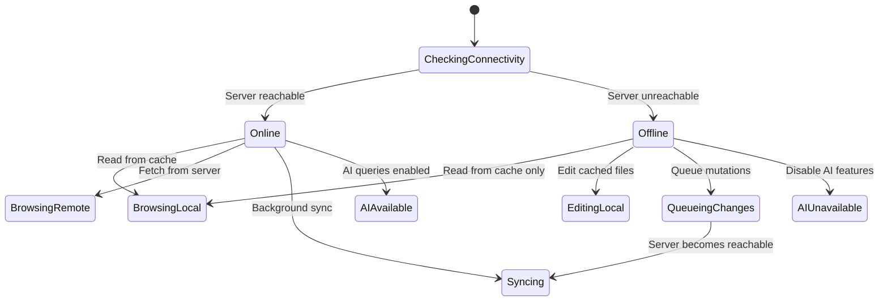

# 03 — Mobile Architecture

## Scope

Architecture specification for `jv-app` — the Flutter-based mobile client that serves as the primary user interface for browsing, editing, and syncing vault content, and querying the AI assistant.

---

## Technology Stack

| Component | Technology |
|---|---|
| Framework | Flutter 3.38+ (stable) |
| Language | Dart |
| Local Database | SQLite (via `sqflite` or `drift`) |
| State Management | Riverpod or BLoC (TBD during implementation) |
| HTTP Client | `dio` with interceptors |
| Secure Storage | `flutter_secure_storage` (Android Keystore) |
| Platform | Android (primary), iOS (future) |

---

## App Architecture

```
jv-app/
├── lib/
│   ├── main.dart
│   ├── app.dart                    # MaterialApp, routing, theme
│   ├── core/
│   │   ├── config/                 # Environment config, server URL
│   │   ├── network/                # Dio client, interceptors, connectivity
│   │   ├── storage/                # SQLite wrapper, file cache manager
│   │   ├── auth/                   # Token storage, refresh logic
│   │   └── errors/                 # Error types and handlers
│   ├── features/
│   │   ├── explorer/               # File browser feature
│   │   │   ├── data/               # Repository implementations
│   │   │   ├── domain/             # Entities, use cases
│   │   │   └── presentation/       # UI (screens, widgets, state)
│   │   ├── editor/                 # Markdown editor feature
│   │   ├── sync/                   # Sync management feature
│   │   ├── ai_chat/                # AI query interface
│   │   ├── secrets/                # Secrets viewer/editor
│   │   └── settings/               # App configuration
│   └── shared/
│       ├── widgets/                # Reusable UI components
│       ├── models/                 # Shared data models
│       └── utils/                  # Common utilities
├── test/
│   ├── unit/
│   ├── widget/
│   └── integration/
├── pubspec.yaml
└── android/
```

> [!NOTE]
> The project follows **Clean Architecture** (data → domain → presentation) to keep each feature independently testable and swappable.

---

## Core Features

### 1. File Explorer
- Folder tree navigation with breadcrumb trail
- File/folder creation, rename, move, delete
- Sort by name, date, size
- Search across synced files (local full-text)
- Visual indicators for sync status per file

### 2. Markdown Editor
- Syntax-highlighted markdown editing
- Live preview mode (toggle)
- Auto-save with debounce (2 seconds idle)
- Markdown toolbar (headings, bold, italic, links, lists)
- Image embedding support (inline preview)

### 3. Media Viewer
- Image preview with zoom/pan
- PDF viewer (embedded)
- Audio/video playback for supported formats
- Download-on-demand for large files

### 4. Sync Manager
- Per-folder sync toggle (select which folders to mirror)
- Visual sync status (synced / pending / conflict / error)
- Manual sync trigger button
- Background sync on app resume (when server reachable)
- Conflict resolution UI (side-by-side diff for text files)

### 5. AI Chat
- Chat-style interface for `POST /ask` queries
- Attach specific files as context
- Auto-retrieve mode (let RAG choose context)
- Streaming response display
- Graceful unavailable state when server is offline

### 6. Secrets Viewer
- List encrypted secret files
- Passphrase input for on-demand decryption
- Decrypt → view → auto-clear pattern (never persist decrypted data)
- Create/edit secrets with re-encryption on save

---

## Offline Architecture



### Offline Capabilities
| Feature | Offline Behavior |
|---|---|
| Browse files | ✅ Cached files available |
| Edit markdown | ✅ Saved locally, queued for sync |
| Create new files | ✅ Created locally, queued for sync |
| Delete files | ✅ Marked for deletion, queued |
| Upload media | ❌ Queued, uploaded when online |
| AI queries | ❌ Disabled with clear message |
| Secrets decrypt | ✅ If key cached in session |
| Search | ✅ Local full-text search |

### Change Queue
- All offline mutations stored in SQLite `change_queue` table
- Each entry: `{action, path, timestamp, payload_hash}`
- On reconnect, queue replayed in order through sync protocol
- Failed items retry with exponential backoff

---

## Local Database Schema

```sql
-- File metadata cache
CREATE TABLE file_cache (
    path TEXT PRIMARY KEY,
    name TEXT NOT NULL,
    type TEXT NOT NULL,          -- 'file' or 'directory'
    size_bytes INTEGER,
    mime_type TEXT,
    last_modified TEXT,          -- ISO 8601
    content_hash TEXT,           -- SHA-256
    sync_enabled INTEGER DEFAULT 0,
    local_path TEXT,             -- Path in app-private storage
    last_synced TEXT             -- ISO 8601
);

-- Pending changes for offline queue
CREATE TABLE change_queue (
    id INTEGER PRIMARY KEY AUTOINCREMENT,
    action TEXT NOT NULL,        -- 'create', 'update', 'delete', 'move'
    path TEXT NOT NULL,
    timestamp TEXT NOT NULL,
    payload_ref TEXT,            -- Local file reference if applicable
    status TEXT DEFAULT 'pending' -- 'pending', 'syncing', 'failed'
);

-- Sync configuration
CREATE TABLE sync_config (
    folder_path TEXT PRIMARY KEY,
    sync_enabled INTEGER DEFAULT 0,
    last_sync_timestamp TEXT,
    sync_direction TEXT DEFAULT 'both'  -- 'both', 'pull_only', 'push_only'
);

-- AI chat history (local only)
CREATE TABLE chat_history (
    id INTEGER PRIMARY KEY AUTOINCREMENT,
    query TEXT NOT NULL,
    response TEXT,
    attachments TEXT,            -- JSON array of file paths
    timestamp TEXT NOT NULL
);
```

---

## Network Layer

### Dio Client Configuration
- Base URL: Tailscale IP of server (configurable in settings)
- JWT token added via interceptor
- Connectivity check before requests (with timeout fallback)
- Retry interceptor: 3 retries with exponential backoff
- Response caching for GET requests (1 hour TTL)

### Connectivity Detection
- Periodic ping to `GET /health` (every 30 seconds when foregrounded)
- On connectivity change → trigger sync if newly online
- Expose `ServerStatus` stream for UI reactivity

---

## Security (Mobile Side)

| Concern | Implementation |
|---|---|
| Token storage | `flutter_secure_storage` (Android Keystore backed) |
| Token refresh | Auto-refresh before expiry via interceptor |
| Secrets passphrase | Prompt each session; never persist |
| Local file encryption | Optional; follows OS-level app sandbox |
| Certificate pinning | Optional for Tailscale cert (future enhancement) |

---

## Error Handling

| Error Type | User Experience |
|---|---|
| Network timeout | Toast: "Server unreachable — working offline" |
| Auth expired | Redirect to login/re-auth screen |
| Sync conflict | Banner with "Resolve conflicts" action |
| File too large | Toast: "File exceeds size limit" |
| AI unavailable | Chat shows "AI is offline" state |
| Disk full (local) | Alert: "Storage full — free space to continue syncing" |

---

## Edge Cases

| Scenario | Handling |
|---|---|
| Server URL changes | Settings screen; clear cache optionally |
| Vault restructured on server | Full re-sync with merge logic |
| App killed during sync | Resume from last confirmed file |
| Large binary files | Stream download; show progress bar |
| Multiple rapid edits | Debounce saves; only latest version synced |

---

## Future Extensibility

- **iOS support**: Flutter makes this straightforward; platform-specific storage adapters needed
- **Desktop companion**: Same Dart codebase could target Windows/macOS
- **Widget/notification**: Android widget showing vault stats / quick-add
- **Biometric auth**: Fingerprint/face unlock before accessing app
- **Voice input**: STT for quick note capture (Phase 4 per roadmap)
