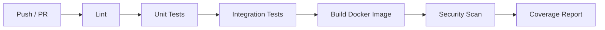

# 09 — Testing Strategy

## Scope

Defines the testing approach across all JARVIS modules — unit, integration, end-to-end, and security testing. Covers test infrastructure, coverage targets, and CI integration.

---

## Testing Pyramid

```
          ┌──────────┐
          │   E2E    │  ← Few, expensive, high confidence
          │  Tests   │     (mobile ↔ server roundtrip)
         ─┤          ├─
        / └──────────┘ \
       /  ┌────────────┐ \
      /   │ Integration │  \  ← Medium count, service boundaries
     /    │   Tests     │   \    (API + filesystem, sync protocol)
    /     └────────────┘     \
   /     ┌──────────────┐     \
  /      │  Unit Tests  │      \  ← Many, fast, isolated
 /       │              │       \    (services, models, utils)
/        └──────────────┘        \
```

---

## Test Matrix by Module

### jv-api (Backend)

| Layer | Test Type | Framework | What's Tested |
|---|---|---|---|
| Models | Unit | pytest | Pydantic schema validation |
| Services | Unit | pytest + tmpdir | Vault file ops against temp directories |
| Auth | Unit | pytest | JWT creation, validation, expiry, revocation |
| Encryption | Unit | pytest | AES encrypt/decrypt roundtrip |
| Routers | Integration | pytest + httpx (TestClient) | Full endpoint request/response cycle |
| Sync | Integration | pytest | Manifest diff, conflict detection/resolution |
| Security | Security | pytest | Path traversal, input validation, rate limits |

#### Key Test Cases: File Operations
```python
# test_vault_service.py
def test_create_file(tmp_vault):
    """Create a file and verify it exists on disk."""

def test_read_file(tmp_vault):
    """Read a known file and verify content."""

def test_delete_file(tmp_vault):
    """Delete a file and verify removal."""

def test_path_traversal_rejected(tmp_vault):
    """Paths containing '..' must raise PathTraversalError."""

def test_symlink_not_followed(tmp_vault):
    """Symlinks should be rejected or ignored."""

def test_unicode_filename(tmp_vault):
    """UTF-8 filenames handled correctly."""

def test_concurrent_writes(tmp_vault):
    """Concurrent writes don't corrupt data."""
```

#### Key Test Cases: Sync
```python
# test_sync_engine.py
def test_manifest_diff_new_file():
    """Client has a file server doesn't → marked for push."""

def test_manifest_diff_server_changed():
    """Server file hash differs, client unchanged → marked for pull."""

def test_manifest_diff_both_changed():
    """Both changed → conflict detected."""

def test_conflict_resolution_creates_conflict_file():
    """Conflict creates {name}_conflict_{ts}.{ext}."""

def test_tombstone_deletion():
    """Deleted file creates tombstone entry."""

def test_tombstone_expiry():
    """Tombstones older than 30 days are cleaned up."""
```

#### Key Test Cases: Security
```python
# test_security.py
def test_missing_jwt_returns_401():
def test_expired_jwt_returns_401():
def test_invalid_jwt_returns_401():
def test_revoked_token_returns_401():
def test_path_traversal_with_dotdot():
def test_path_traversal_with_encoded_dotdot():
def test_rate_limit_exceeded_returns_429():
def test_oversized_upload_returns_413():
```

### jv-brain (AI Layer)

| Layer | Test Type | Framework | What's Tested |
|---|---|---|---|
| Document Loader | Unit | pytest | File type detection, text extraction |
| Chunking | Unit | pytest | Chunk size, overlap, boundary handling |
| Embedding | Integration | pytest + mock Ollama | Embedding generation |
| Retrieval | Integration | pytest + test ChromaDB | Top-K retrieval accuracy |
| Context Assembly | Unit | pytest | Prompt construction, token budget |
| End-to-End | Integration | pytest | Query → retrieval → prompt → (mock) response |

#### Key Test Cases: AI
```python
# test_document_loader.py
def test_load_markdown():
def test_load_pdf():
def test_skip_binary_files():
def test_skip_secrets_folder():
def test_max_file_size_limit():

# test_chunking.py
def test_chunk_size_within_limit():
def test_chunk_overlap():
def test_small_file_single_chunk():
def test_empty_file():

# test_retrieval.py
def test_relevant_results_returned():
def test_score_threshold_filtering():
def test_path_prefix_filter():
def test_no_results_returns_empty():
```

### jv-app (Mobile)

| Layer | Test Type | Framework | What's Tested |
|---|---|---|---|
| Models | Unit | flutter_test | Data serialization/deserialization |
| Services | Unit | flutter_test + mockito | API client, sync logic, encryption |
| Widgets | Widget | flutter_test | UI rendering, interaction |
| Features | Widget | flutter_test | Feature screens with mocked data |
| Integration | Integration | integration_test | Full app flows with mocked server |

#### Key Test Cases: Mobile
```dart
// test/unit/sync_service_test.dart
test('new local file queued for push');
test('server change detected for pull');
test('offline changes queued correctly');
test('queue replayed on reconnect');

// test/widget/file_explorer_test.dart
testWidgets('displays folder tree');
testWidgets('navigates into subfolder');
testWidgets('shows sync status badges');
testWidgets('offline mode banner shown');

// test/widget/markdown_editor_test.dart
testWidgets('renders markdown content');
testWidgets('auto-saves after debounce');
testWidgets('shows unsaved changes indicator');
```

---

## Test Infrastructure

### Backend Test Environment
```yaml
# docker-compose.test.yml
services:
  api-test:
    build: ./server
    command: pytest -v --cov=app --cov-report=html
    volumes:
      - ./server:/app
    environment:
      JARVIS_VAULT_PATH: /tmp/test-vault
      JARVIS_JWT_SECRET: test-secret-key
    networks:
      - test-net

  chromadb-test:
    image: chromadb/chroma:latest
    networks:
      - test-net

networks:
  test-net:
```

### Test Data Fixtures
```
tests/fixtures/
├── sample_vault/
│   ├── Personal/
│   │   └── notes.md
│   ├── Work/
│   │   └── project.md
│   └── Secrets/
│       └── passwords.md.jvs
├── sample_files/
│   ├── large_file.pdf
│   ├── image.png
│   └── unicode_名前.md
└── sync_scenarios/
    ├── no_conflict.json
    ├── both_modified.json
    └── delete_conflict.json
```

---

## Coverage Targets

| Module | Line Coverage | Branch Coverage |
|---|---|---|
| jv-api services | ≥ 90% | ≥ 80% |
| jv-api routers | ≥ 85% | ≥ 75% |
| jv-brain pipeline | ≥ 85% | ≥ 75% |
| jv-app services | ≥ 80% | ≥ 70% |
| jv-app widgets | ≥ 70% | — |

---

## CI Pipeline



### GitHub Actions Workflow
```yaml
name: JARVIS CI
on: [push, pull_request]

jobs:
  backend-tests:
    runs-on: ubuntu-latest
    steps:
      - uses: actions/checkout@v4
      - name: Build test containers
        run: docker compose -f docker-compose.test.yml build
      - name: Run tests
        run: docker compose -f docker-compose.test.yml run api-test
      - name: Upload coverage
        uses: actions/upload-artifact@v4
        with:
          name: coverage-report
          path: server/htmlcov/

  mobile-tests:
    runs-on: ubuntu-latest
    steps:
      - uses: actions/checkout@v4
      - uses: subosito/flutter-action@v2
        with:
          flutter-version: '3.38.x'
      - run: cd mobile && flutter test --coverage

  lint:
    runs-on: ubuntu-latest
    steps:
      - uses: actions/checkout@v4
      - run: cd server && pip install ruff && ruff check .
      - run: cd mobile && flutter analyze
```

---

## Security Testing

| Test | Method | Frequency |
|---|---|---|
| Path traversal | Automated (pytest) | Every CI run |
| JWT validation | Automated (pytest) | Every CI run |
| Input fuzzing | Semi-automated (hypothesis) | Weekly |
| Dependency vulnerabilities | `pip-audit` + `flutter pub audit` | Every CI run |
| Docker image scan | Trivy or Snyk | Every build |

---

## Performance Testing

| Test | Metric | Target |
|---|---|---|
| File listing (1000 files) | Response time | < 500ms |
| File upload (10MB) | Throughput | > 5 MB/s local |
| Sync manifest (500 files) | Diff computation | < 1s |
| AI query (retrieval) | Vector search time | < 500ms |
| AI query (full) | End-to-end latency | < 15s |

---

## Test Running Commands

```powershell
# Backend unit tests
docker compose -f docker-compose.test.yml run api-test pytest tests/ -v

# Backend with coverage
docker compose -f docker-compose.test.yml run api-test pytest --cov=app --cov-report=term-missing

# Mobile unit tests
cd mobile; flutter test

# Mobile with coverage
cd mobile; flutter test --coverage

# Full integration (requires all services running)
docker compose up -d
pytest tests/integration/ -v --server-url http://localhost:8000
```

---

## Future Extensibility

- **Load testing**: Locust or k6 for concurrent user simulation
- **Chaos testing**: Random container kills to verify resilience
- **Contract testing**: Pact for API contract verification between mobile and backend
- **Visual regression**: Screenshot testing for mobile UI
