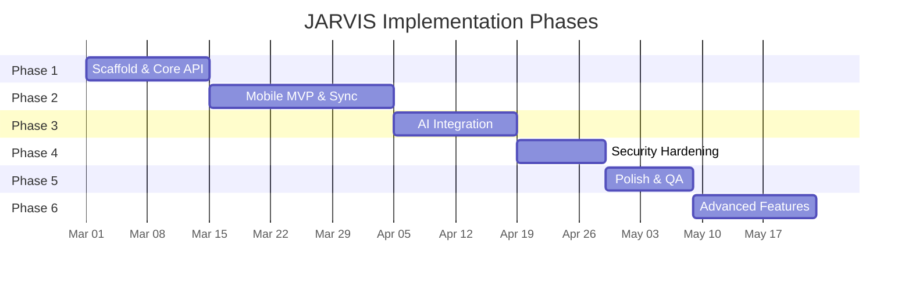
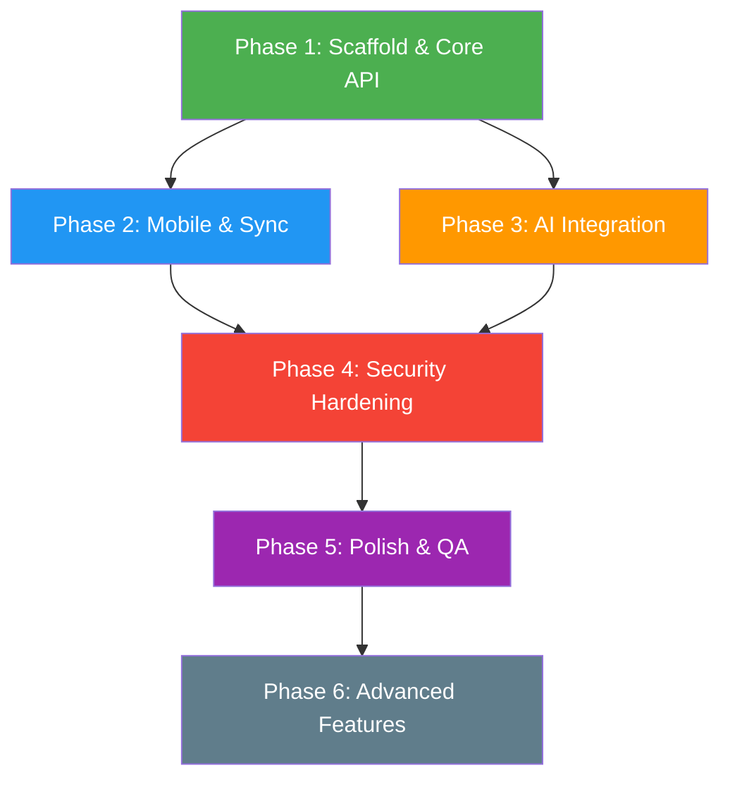

# 10 — Implementation Phases

## Scope

Defines the phased delivery plan for building JARVIS end-to-end. Each phase produces a working, testable increment. Phases are ordered to minimize risk and maximize early usability.

---

## Phase Overview

> [!NOTE]
> Timeline estimates are rough guidance. Actual pace depends on implementation decisions made during each phase. The ordering is non-negotiable; the durations are flexible.

---

## Phase 1: Scaffold & Core Backend (✅ Complete)

### Goal
A working Dockerized backend that can list, read, create, update, and delete files in `/JARVIS`, accessible over localhost.

### Deliverables
| # | Task | Exit Criteria |
|---|---|---|
| 1.1 | **Repository structure** | Monorepo with `/server`, `/mobile`, `/infra`, `/docs` directories |
| 1.2 | **Docker Compose MVP** | `docker compose up` starts `jv-api` and `ollama` containers |
| 1.3 | **Health endpoint** | `GET /health` returns `{"status": "ok"}` |
| 1.4 | **File CRUD endpoints** | `GET/POST/PUT/DELETE /files/{path}` working against `/JARVIS` mount |
| 1.5 | **Upload/Download** | Multipart upload + streaming download working |
| 1.6 | **Config & .env** | `.env.template` with documented variables; Pydantic settings-based config loader |
| 1.7 | **Unit tests** | ≥ 90% coverage on vault service; path traversal tests passing |
| 1.8 | **API documentation** | Auto-generated OpenAPI (Swagger UI) at `/docs` |

### Validation
- `docker compose up -d` → API responds on `localhost:8000`
- Can create, read, update, delete files via curl/Postman
- Path traversal attacks return `400`
- All unit tests pass

### Dependencies
- Docker Desktop running
- Python 3.14 available for local development

---

## Phase 2: Mobile MVP & Sync Engine (✅ Complete)

### Goal
A Flutter app that browses the vault, edits markdown, works offline, and syncs selectively with the server.

### Deliverables
| # | Task | Exit Criteria |
|---|---|---|
| 2.1 | **Flutter project scaffold** | Clean architecture structure, navigation, theming |
| 2.2 | **File explorer UI** | Folder tree, breadcrumbs, file listing with icons |
| 2.3 | **Markdown editor** | Open, edit, save markdown files with syntax highlighting |
| 2.4 | **Server connection** | Configure Tailscale IP; Dio client with JWT auth |
| 2.5 | **Local SQLite cache** | File metadata cached; works without server |
| 2.6 | **Selective sync toggle** | Per-folder sync enable/disable in UI |
| 2.7 | **Sync manifest exchange** | `POST /sync/manifest` implementation on both sides |
| 2.8 | **Push/Pull transfer** | Files transfer both directions with hash verification |
| 2.9 | **Conflict detection** | True conflicts surfaced in SQLite `MutationQueue` |
| 2.10 | **Offline queue** | Changes queued in SQLite; replayed on reconnect |
| 2.11 | **Tailscale integration** | App connects to server over Tailscale only |

### Validation
- App shows the same folder structure as `/JARVIS`
- Edit a file on mobile → sync → visible on server and vice versa
- Turn off server → make edits → start server → sync succeeds
- Conflict scenario produces `_conflict` file
- Tailscale-only connectivity verified (no local network access)

### Dependencies
- Phase 1 complete
- Tailscale installed on both devices

---

## Phase 3: AI Integration (🟡 In Progress)

### Goal
The user can ask questions from the mobile app and get answers grounded in their vault files.

### Deliverables
| # | Task | Exit Criteria |
|---|---|---|
| 3.1 | **jv-brain service scaffold** | Docker container running alongside jv-api |
| 3.2 | **Document loader** | Reads `.md`, `.txt`, `.pdf` from vault |
| 3.3 | **Text chunking** | Splits documents into 512-token chunks with overlap |
| 3.4 | **Embedding pipeline** | `nomic-embed-text` via Ollama generates 768-dim vectors |
| 3.5 | **ChromaDB integration** | Chunks stored and queryable in vector store |
| 3.6 | **Incremental indexing** | New/changed files indexed without full re-index |
| 3.7 | **Retrieval endpoint** | `POST /ask` retrieves top-K context, calls Ollama, returns answer |
| 3.8 | **File attachments** | User can attach specific files as context |
| 3.9 | **Streaming response** | Tokens streamed to mobile UI in real-time |
| 3.10 | **Mobile AI chat UI** | Chat interface with source citations |
| 3.11 | **Index status** | `GET /ask/index-status` reports indexing health |

### Validation
- Index 50+ vault files → `GET /ask/index-status` shows correct count
- `POST /ask` with relevant question → answer cites correct source files
- Attach a specific file → answer uses that file's content
- Streaming works in mobile UI
- `/Secrets` folder is NOT indexed

### Dependencies
- Phase 1 complete (API endpoints)
- Ollama container with `llama3` + `nomic-embed-text` models

---

## Phase 4: Security Hardening

### Goal
Lock down all access with JWT auth, device registration, encryption of secrets, and comprehensive input validation.

### Deliverables
| # | Task | Exit Criteria |
|---|---|---|
| 4.1 | **JWT implementation** | HS256 tokens with configurable expiry |
| 4.2 | **Device registration flow** | First device via setup secret; subsequent via approval |
| 4.3 | **All endpoints protected** | Every endpoint (except `/health`) requires valid JWT |
| 4.4 | **Token revocation** | Revoked tokens rejected immediately |
| 4.5 | **Rate limiting** | Per-endpoint rate limits enforced |
| 4.6 | **Secrets encryption** | AES-256-GCM encrypt/decrypt for `/Secrets` files |
| 4.7 | **Secrets API** | `POST /secrets/encrypt`, `POST /secrets/decrypt`, `GET /secrets` |
| 4.8 | **Mobile secure storage** | JWT stored in Android Keystore |
| 4.9 | **Audit logging** | All mutations logged with device identity |
| 4.10 | **Input hardening** | Path validation, size limits, CORS policy |
| 4.11 | **Security tests** | Full security test suite passing |

### Validation
- Unauthenticated requests return `401`
- Expired/revoked tokens return `401`
- Path traversal returns `400`
- Secrets encrypt → decrypt roundtrip works
- Wrong passphrase returns `403`
- Audit log captures all mutations
- Rate limit returns `429` when exceeded

### Dependencies
- Phase 2 complete (mobile app for testing auth flow)

---

## Phase 5: Polish & QA

### Goal
System is robust, well-documented, and ready for daily use.

### Deliverables
| # | Task | Exit Criteria |
|---|---|---|
| 5.1 | **Integration test suite** | API + sync + AI tested end-to-end |
| 5.2 | **CI pipeline** | GitHub Actions: lint, test, build, security scan |
| 5.3 | **Migration test** | Copy `/JARVIS` to fresh machine → `docker compose up` → all features work |
| 5.4 | **Backup/restore** | Full backup → destroy → restore → verify |
| 5.5 | **Mobile UI polish** | Consistent theming, error toasts, loading states |
| 5.6 | **Documentation** | Install guide, migration guide, Tailscale setup, API reference |
| 5.7 | **Performance check** | File ops < 500ms, AI queries < 15s |
| 5.8 | **Edge case handling** | Empty dirs, large files, unicode names, disk full |

### Validation
- All CI checks pass
- Migration test succeeds on a clean machine
- Backup/restore preserves all data and functionality
- No unhandled errors in normal usage flows

### Dependencies
- Phases 1–4 complete

---

## Phase 6: Advanced Features (Post-MVP)

### Goal
Enhanced capabilities building on the solid foundation.

### Deliverables
| # | Task | Priority |
|---|---|---|
| 6.1 | **Voice input (STT)** | Medium — quick note capture |
| 6.2 | **Smart tagging** | Medium — auto-categorize new files |
| 6.3 | **Relationship graph** | Low — entity extraction and knowledge graph |
| 6.4 | **Daily digest** | Low — AI-generated briefing from recent changes |
| 6.5 | **Client-side decryption** | Medium — decrypt secrets without sending passphrase to server |
| 6.6 | **Multi-model support** | Low — swap LLMs via config |
| 6.7 | **Web dashboard** | Low — read-only browser view behind Tailscale |
| 6.8 | **Biometric app lock** | Medium — fingerprint/face unlock |

### No Fixed Timeline
Phase 6 items are implemented based on usage needs after the system is operational.

---

## Phase Dependency Graph

> [!IMPORTANT]
> Phases 2 and 3 can be developed **in parallel** after Phase 1 is complete. Phase 4 (Security) depends on both Phase 2 and 3 because JWT auth must be tested with both mobile sync and AI queries.

---

## Risk-Adjusted Ordering Rationale

| Decision | Rationale |
|---|---|
| File API before AI | Files are the foundation; AI builds on them |
| Sync before Security | Need a working mobile→server flow to test auth against |
| AI before Security | AI is a core feature; delaying it risks late integration issues |
| Security as a dedicated phase | Prevents shortcuts; ensures all endpoints are hardened consistently |
| Polish as a phase | Catches integration bugs that per-feature testing misses |

---

## Architectural Risks

| Risk | Impact | Mitigation |
|---|---|---|
| Tailscale port binding conflict | Mobile can't reach server | Test both `127.0.0.1` and `0.0.0.0` binding strategies early |
| Ollama memory pressure | OOM kills during inference | Set memory limits in Docker; test with target hardware |
| Sync complexity explosion | Buggy sync loses data | Build simplest sync first (hash compare); add complexity incrementally |
| Embedding model quality | Poor retrieval results | Test with real vault content in Phase 3; swap model if needed |
| Flutter state management | Complex offline + sync + cache state | Choose state management (Riverpod/BLoC) early and commit |

---

## Critical Design Decisions

| Decision | Chosen | Alternative | Rationale |
|---|---|---|---|
| Vector DB | ChromaDB | pgvector | Simpler setup for MVP; migrate later if needed |
| State management | TBD (Riverpod vs BLoC) | — | Decide in Phase 2 based on sync complexity |
| Sync model | Manifest-based | Event-sourced | Simpler; works offline without event log |
| Encryption KDF | PBKDF2 | Argon2id | Cross-platform compatibility (Python + Dart) |
| LLM model | llama3 | mistral, phi-3 | Widely supported; good reasoning quality |

---

## Areas Requiring Early Validation

| Area | Why | When |
|---|---|---|
| **Tailscale → Docker port routing** | If mobile can't reach the API, nothing else works | Phase 1, Day 1 |
| **Ollama on target hardware** | Must verify inference speed and memory fit | Phase 1 |
| **Sync conflict handling** | Most complex algorithm; bugs here lose user data | Phase 2, early |
| **ChromaDB persistence** | Must survive container restarts | Phase 3, early |
| **JWT + Tailscale interplay** | Auth must work over Tailscale IPs, not localhost | Phase 4, early |
| **AES encrypt/decrypt roundtrip** | Encryption must work identically in Python and (optionally) Dart | Phase 4 |
